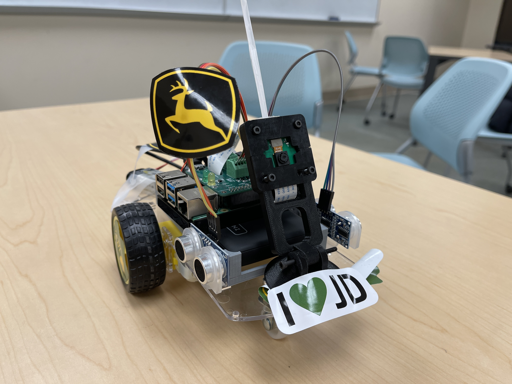

<h1 align="center">
Digital Ava -- A Friendly and Secure Toy for Kids
</h1>

  

## Team Members
Xinyi Wei (xwei16@illinois.edu)

Owen Xu (jinyuxu2@illinois.edu)

Dongming Liu (dl35@illinois.edu)

Elijah Ye (gaohany2@illinois.edu)

## Introduction
This [Hackathon Project](https://devpost.com/software/digital-ava-a-friendly-and-secure-toy-for-kids) aims to develop a digital companion for children and a monitoring tool for parents — an autonomous vehicle leveraging the latest technologies. By combining hardware components and software systems, our objective is to create a self-driving vehicle designed to follow a person using face detection. This project entails integrating a variety of sensors, including cameras and distance sensors, to provide the vehicle with a full understanding of its surroundings. Utilizing computer vision, our focus is on crafting a vehicle that not only perceives and comprehends its environment but also makes informed decisions to trail the person. As children engage with this interactive toy, parents can simultaneously keep an eye on their little ones through photos captured by our autonomous vehicle, ensuring a blend of fun and safety at home.

## Problem Description
In today's fast-paced world, ensuring the safety of children has become a paramount concern for parents and guardians. With the increasing demand for autonomy, children are often left unsupervised in public spaces, leading to potential safety risks. Traditional methods of supervision, such as constant visual monitoring, are not always feasible in busy environments. Additionally, the rise of technology introduces new opportunities for monitoring but also brings forth challenges in implementation.

## Solution Explanation
To address the safety concerns of children in public spaces, we developed an innovative solution leveraging autonomous toy car technology and computer vision. Our solution consists of a Raspberry Pi-powered toy car equipped with a Raspberry Pi Camera Module and an H-bridge motor driver. Utilizing the OpenCV library, we implemented facial recognition capabilities on the toy car.

When a child is detected within the toy car's field of view, the system captures an image of the child's face. Subsequently, the toy car initiates a series of actions to ensure the child's safety. Firstly, it moves towards the child, providing a visual indication of its presence. Secondly, it tracks the child's movements, ensuring continuous monitoring. This proactive approach not only enhances the safety of the child but also provides reassurance to parents and guardians.

By integrating facial recognition technology into an autonomous toy car, we offer a versatile solution that can be deployed in various indoor environments, such as homes, daycare centers, or play areas. Moreover, the captured images can serve as a valuable tool for parental monitoring, allowing parents to remotely assess their child's whereabouts and well-being. Through this project, we aim to harness the power of technology to create safer environments for children and peace of mind for parents.

## Video of the Vehicle Working
You can check the demo video at https://youtu.be/AKtvVXPslzk.

## Integrity
We used ChatGPT as our consultants for code syntax inqueries and an opencv built-in model for face detection.  
Our inspiration comes from a thought of one of our teammate, Owen Xu.
